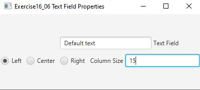

# Demonstrate Text Field Properties

For this project we had to create a program that sets the horizontal-alignment and column-size properties of a text field
dynamically.

## Example Output



## Analysis Steps

Although the project description made it seem as if this program would only have two pieces to it, upon closer inspection
this program entails quite a bit more. To me, there were three large components to it and each of those components had their 
sub-components. More will be explained in the testing section.

### Design

There was an image provided that gave a general scope of how things should appear. There should be an editable "main" text field, 
radio buttons that controlled the alignment of the text in the text field 
(it would be a total of three, one for left-align, one for center-align
and one for right-align), and finally a text field that would read input to determine the size of the editable "main" text field.

### Testing

A step by step series of examples that you developed to properly test the program. 

Step one: 

```
First I had to determine the best way to format all of the items. I experimented with an HBox, but I quickly realized that
it would hinder my ability to complete the project to my satisfaction so I opted to use a grid pane instead. That way, I could
easily format everything and make it look nice. 
```

Step two: 

```
Then I created the different components of the project and put them in the location I desired for them to be. I started by creating
the three radio buttons that controlled alignment and put them all in a toggle group. I also created the main text field in this 
step as well as the column size text field. However, I did not add any functionality to these items quite yet. I wanted to make 
sure everything was aligned and looking good. I will also note here that I reviewed the Oracle Java documentation on grid pane
so that I could add column and row constraints to the grid. "By default, rows and columns will be sized to fit their content."
```

Step three

```
Now that everything was aligned properly, I had to add the functionality to the program. I started with the radio buttons since
it seemed like it would be the most straightforward. After becoming acquainted with the documentation for radio button handlers, I
implemented three different handlers for the three radio buttons, each with their respective function. Using simple if-logic, I 
was able to achieve the dynamic aligning of the text field.
```

Step four
```
At this point, I needed to add the ability to resize the text field according to the user's input. I also needed to create a "safety 
measure" for when a user did not enter a number. I accomplished this via a try-catch method. While I was navigating the try-catch
implementation, I realized that I would have to convert the character sequence to string, convert that string to integer, then 
make the new column size the integer. Luckily, I was able to fit all of that into one line of code and use the try-catch method 
for any issues, although the only error I could imagine is the user not entering a number. You can see this in line 108.
```

## Notes

For anyone using this program, the handler for changing the PrefColumnCount will only function if you hit ENTER. If you only type
the number in, nothing will happen.

## Do not change content below this line
## Adapted from a README Built With

* [Dropwizard](http://www.dropwizard.io/1.0.2/docs/) - The web framework used
* [Maven](https://maven.apache.org/) - Dependency Management
* [ROME](https://rometools.github.io/rome/) - Used to generate RSS Feeds

## Contributing

Please read [CONTRIBUTING.md](https://gist.github.com/PurpleBooth/b24679402957c63ec426) for details on our code of conduct, and the process for submitting pull requests to us.

## Versioning

We use [SemVer](http://semver.org/) for versioning. For the versions available, see the [tags on this repository](https://github.com/your/project/tags). 

## Authors

* **Billie Thompson** - *Initial work* - [PurpleBooth](https://github.com/PurpleBooth)

See also the list of [contributors](https://github.com/your/project/contributors) who participated in this project.

## License

This project is licensed under the MIT License - see the [LICENSE.md](LICENSE.md) file for details

## Acknowledgments

* Hat tip to anyone who's code was used
* Inspiration
* etc
